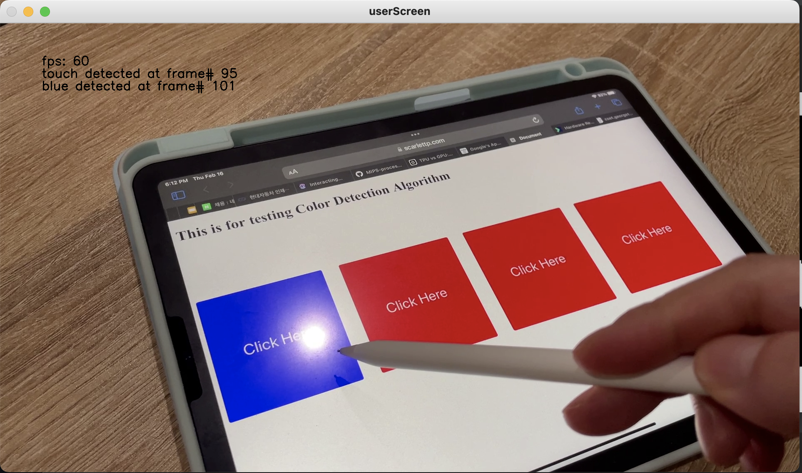

# A Touchscreen Latency Study
## Tap and Drag Latency measuring tool(Automatic)

## Introduction

Latency in a system’s response to user input adversely impacts user performance.
Therefore, system designers need an approachable and effective way to measure such latency to determine its impacts.
However, currently proposed approaches require additional equipment or much manual work.
These requirements limit the usability of the methods.
A study shows that any increase in latency decreases user performance, and users may be able to perceive latency as low as 1ms (Jota et al., 2013).
An effort to accurately measure the latency will be considerably helpful for enhancing the latency performance to improve user experience.
Therefore, I propose an automated latency measuring system using an object tracking algorithm.
This system automatically measures the distance between the finger position and the tracking graphic by converting the number of pixels to physical distance.
The latency can be measured by estimating the velocity of finger movement.
This approach only requires a camera and a device which will ease much burden on users.
Using this automated system, a user can measure an accurate touchscreen latency only by clicking the target area on the screen.

## Used Algorithm
- Object detection
- Object tracking
- Color Detection

## Used Library
- OpenCV

## Details

### Drag Latency Measure

Based on the user input on the screen size, the tool calculates cm/pixel for further uses

Using the distance between the finger and tracking object, latency value can be obtained.
To use this method, the velocity of the finger has to be estimated
- Speed = Distance/Time, Time = Distance/Speed

Using the frame count differnece, latency value can be obtained.
The tool will capture the moment when the tracking object reaches the current finger position.

### Tap Latency Measure

The user is going to click a button when they see the clicking moment.
To capture the exact moment of touch, a mirror is placed on the side to see the screen from the side angle.

The tool automatically captures the moment blue is captured.
Then, it calculates the frame count difference between the output and input to calculate the latency.

### Note!
The tool needs further modularization.
More update aspects remain